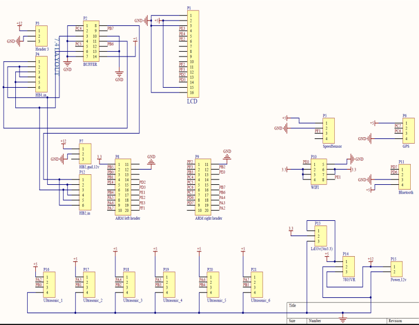

---

## Collision_Warning_System_Based_on_V2V_communication

---

* Implementation of a real time vehicle to vehicle communications system over a
  local WIFI network between cars where we Broadcast car data and state to avoid
  the potential collisions
* System Components: **AUTOSAR** Layered Architecture, **FreeRTOS**, **ARM** Cortex TM4C123G,
  **WIFI** module, **GPS** module, Six ultrasonics sensors, Camera and Speed sensor
* Handling the Collision scenarios:
  1. Emergency Electronics Brake Lights (EEBL)
  2. Blind Spot Warning (BSW)
  3. Don’t Pass Warning (DNPW)
* Sponsored by 

---

---

[Applications Video](https://www.youtube.com/watch?v=WMBwceItSCk)

---

[basic ultrasonic tasks](https://www.youtube.com/watch?v=eOSkh61GYOM)

---

# Project Description

---

### Applications

---

* Using vehicle-to-vehicle (V2V) communication, a vehicle can detect the position and movement of other
  vehicles up to a quarter of a kilometer away. In area world where vehicles are equipped with a simple
  antenna, a computer chip and GPS (Global Positioning System) Technology, your car will know where
  the other vehicles are, additionally other vehicles will Know where you are too whether it is in blind
  spots, stopped ahead on the highway but hidden from view, around a blind corner or blocked by other
  vehicles. The vehicles can anticipate and react to changing driving situations and then instantly warn the drivers with emergency warning messages. If the driver doesn’t respond to the alerts message, the vehicle can bring itself to a safe stop, avoiding a collision.

* So, our project elaborates Implementation of a real time vehicle to vehicle communication system over a local WIFI network between cars where we broadcast car data and state to avoid potential collisions.
  Specifically handling 4 main applications.

1. EMERGENCY ELECTRONIC BRAKE LIGHTS (**EEBL**)

when there is a hard braking vehicle in the pass ahead , three vehicles are traveling in the same lane you are driving the last vehicle and you can’t see the first vehicle because it’s been blocked by the car in front of you ,unexpectedly the vehicle slams on its brakes ,duo to v2v communication the car can produce a waning of the braking car ahead.

2. BLIND SPOT WARNING(**BSW**)

when there is a car that may not be visible to the car driver, because of v2v communication a warning message is issued to make you aware of the presence of this vehicle , should you attempt to lane change this warning message will tell you that it’s not safe to lane change.

3. DO NOT PASS WARNING(**DNPW**)

a safety application is intended to let the driver know that it’s not safe to attempt to pass a slower moving vehicle because of incoming traffic in the passing zone, if a vehicle is detected in the passing done a warning message is provided letting you know that the passing situation is potentially unsafe.

---

### System Layout

---

---

* **NEO 6 M** GPS module

  

* **HC-SR04** Ultrasonic module

  

* **LM 393** speed sensor

  

* **ESP8266-01** wifi module

  

* **HC05** bluetooth module

---

## Hardware

---

